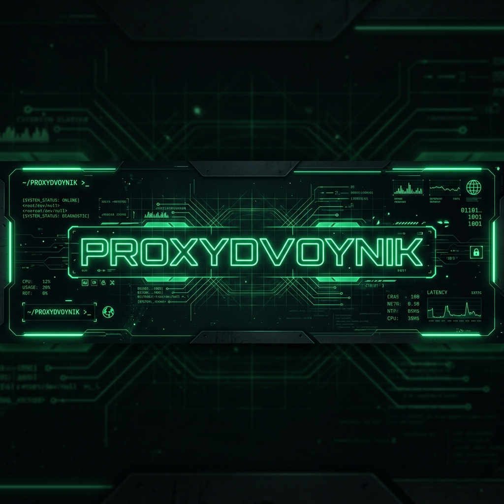

````md


<p align="center">
  
</p>

<h1 align="center">👋 Hey, I'm Harshith Saveesh</h1>

<p align="center">
  CSE Student • Full-Stack Developer in Progress • Anime Enthusiast • Professional Bug Creator
</p>

---

### 💻 SYSTEM METRICS DECRYPT

```yaml
[NODE]: proxydvoynik
[REAL_NAME]: Harshith Saveesh
[COORDINATES]: Dimension C-137 // Earth
[TIMEZONE]: UTC +05:30
[TRANSMISSION]: Secure Terminal Uplink Established

[CURRENT_MISSION]:
  - Learning software engineering fundamentals
  - Building projects instead of collecting tutorials
  - Exploring full-stack development

[CURRENT_OBSESSION]:
  - Full-Stack Development
  - Problem Solving
  - Anime
  - Building things that seemed easier in my head
````

---

### 📡 ACTIVE CORE MODULES

```bash
$ cat active_projects.json

{
  "CivicFix": {
    "module_type": "AI-Powered Hyperlocal Infrastructure Reporter",
    "description": "Enables citizens to identify, verify, track, and resolve community problems.",
    "tech_stack": [
      "JavaScript",
      "HTML",
      "CSS"
    ],
    "node_uplink": "https://github.com/proxydvoynik/CivicFix"
  },

  "Rank_Game": {
    "module_type": "Interactive Reddit Game Engine",
    "description": "A Reddit Devvit sorting game where players rank items by category.",
    "tech_stack": [
      "GameMaker Language",
      "Devvit"
    ],
    "node_uplink": "https://github.com/proxydvoynik/Rank_Game"
  },

  "studenthub_harshith": {
    "module_type": "Personal Academic Dashboard",
    "description": "A centralized command centre for managing academics and daily student life.",
    "tech_stack": [
      "HTML",
      "CSS",
      "JavaScript"
    ],
    "node_uplink": "https://github.com/proxydvoynik/studenthub_harshith"
  }
}
```

---

### 🛠️ COGNITIVE INTEGRATIONS & TOOLS

<p align="center">
  
  
  
  
  
  
  
</p>

<p align="center">
  
  
  
  
  
</p>

---

### 📈 TERMINAL LOGS

```bash
$ whoami
Harshith Saveesh

$ current_status
Learning, building, debugging, repeating.

$ currently_learning
> Full-Stack Development
> Data Structures & Algorithms
> Software Design

$ favorite_anime
Steins;Gate

$ hobbies
> Anime
> Gaming
> Building random projects at 2 AM

$ philosophy
> Build first. Optimize later.

$ current_worldline
> Searching for the Steins Gate.
```

---

### 🌐 SECURE UPLINK

<p align="center">
  <a href="https://www.linkedin.com/in/harshithsaveesh/">
    
  </a>
</p>

---

<p align="center">
  <sub>
    <i>"Wubba Lubba Dub Dub!"</i>
  </sub>
</p>

<p align="center">
  <sub>
    <i>El Psy Kongroo.</i>
  </sub>
</p>
```
